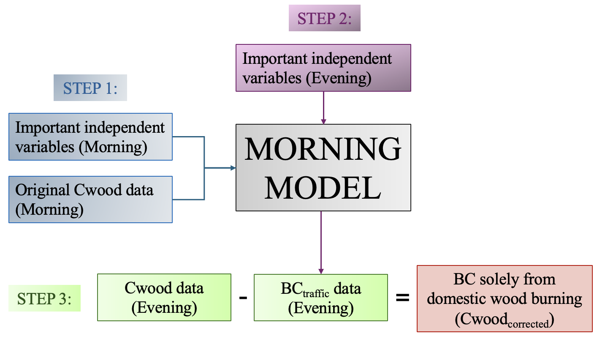

# Machine Learning Correction of Traffic Influence on Long-Term Aethalometer Trends in Wood Burning Black Carbon

This repository contains the R code and data processing pipeline for this article. It presents a machine learning framework (Stacked Ensemble of Random Forest and XGBoost) to isolate wood burning black carbon ($C_{wood}$) from traffic interference at UK urban and rural background sites between 2009 and 2020.

## 📂 Repository Structure

The project is organized into three main folders:

    cwood-correction-ml/
    ├── data/                    # Input data files (Zipped & Text)
    ├── scripts/                 # R scripts for analysis (numbered 01-06)
    └── plots/                   # Output figures generated by the analysis

## 🚀 How to Run the Analysis

**⚠️ Pre-requisite:** Before running any scripts, please navigate to the `data/` folder and **unzip** `data.zip`. The scripts require the extracted `.txt` files to be present in the root of the `data/` folder.

The scripts are numbered sequentially. Please run them in the following order:

### 1. Data Acquisition
* **`01a_Download_AURN_Data_UB.R`**: Downloads Urban Background (UB) air quality data and merges it with the local wood burning datasets.
* **`01b_Download_AURN_Data_RB.R`**: Downloads Rural Background (RB) air quality data and merges it with local datasets (including Detling site data).

### 2. Weather Data Processing
* **`02a_Process_Weather_UB.R`**: Extracts meteorological variables for Urban sites from ERA5 NetCDF files for the years 2009–2020.
* **`02b_Process_Weather_RB.R`**: Extracts meteorological variables for Rural sites.
    * **⚠️ Important Note:** The raw weather files (`.nc` format) are **not included** in this repository due to GitHub file size limits.
    * To run these scripts, you must obtain the yearly weather files (e.g., `weather_2009.nc`) and place them in a local folder named `data/weather_raw/`.

### 3. Feature Selection
* **`03a_FeatureSelection_UB.R`**: Performs Recursive Feature Elimination (RFE) to identify the most important predictors for Urban sites.
* **`03b_FeatureSelection_RB.R`**: Performs the same RFE process for Rural sites.

### 4. Model Training & Estimation
* **`04a_Cwood_Estimation_UB.R`**: Trains the Stacked Ensemble model for Urban sites, predicts "Traffic Cwood," calculates the wood burning residual, and runs a sensitivity test.
* **`04b_Cwood_Estimation_RB.R`**: Performs the same estimation and sensitivity analysis for Rural sites.

### 5. Validation
* **`05_Validate_Model_vs_NAEI.R`**: Validates the model estimates by comparing long-term trends against the UK National Atmospheric Emissions Inventory (NAEI).

### 6. Visualization
* **`06_Plot_TimeSeries.R`**: Generates the final figures, including diurnal profiles, seasonal trends, and ratio analysis ($C_{wood}/PM$).

## 📦 Requirements

All analysis was performed using **R**. The key packages required are:

* `tidyverse` (Data manipulation and plotting)
* `h2o` (Machine Learning models)
* `openair` (Air quality specific analysis)
* `saqgetr` (AURN data download)
* `caret` (Feature selection)
* `raster` / `ncdf4` (Weather data processing)

## 📄 Data Availability

* **Air Quality Data:** Publicly available from the UK [Automatic Urban and Rural Network (AURN)](https://uk-air.defra.gov.uk/).
* **Emissions Data:** Available from the [NAEI](https://naei.beis.gov.uk/).
* **Weather Data:** The meteorological data used (ERA5 reanalysis) could not be included due to size limits. It is available for download from the [Copernicus Climate Data Store (CDS)](https://cds.climate.copernicus.eu/).
    * *Note:* Researchers should download "ERA5 hourly data on single levels" covering the UK domain for years 2009–2020.

---
Author: I S Wong
